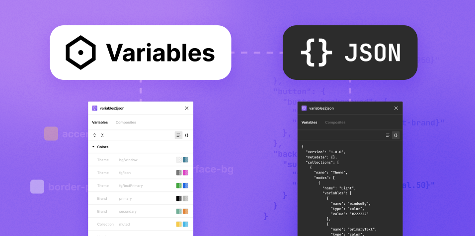
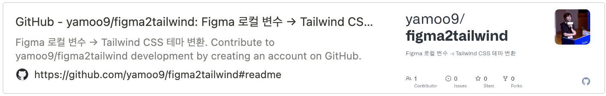

# Figma Variables → Tailwind Theme

Figma 로컬 변수(Local variables)를 Tailwind CSS 사용자 정의 테마(Theme)로 변환하는 프로그램

## 사용법

아래 나열된 순서대로 figma2tailwind 프로그램을 사용합니다.

### 1. Figma → JSON 내보내기

Figma 디자인 시안에 구성된 로컬 변수를 [variables2json](https://www.figma.com/community/plugin/1253571037276959291/variables2json) 플러그인을 사용해 JSON 파일로 내보냅니다.



### 2. figma2tailwind 다운로드

[degit](https://github.com/Rich-Harris/degit#degit-straightforward-project-scaffolding) 명령을 사용해 [yamoo9/figma2tailwind](https://github.com/yamoo9/figma2tailwind) 저장소 자료를 프로젝트 디렉토리에 복사합니다.

```sh
degit yamoo9/figma2tailwind convertTokens
```



### 3. 프로그램 실행

복사된 프로그램 디렉토리 이름으로 node 명령을 실행하면 기본 옵션을 사용해 Tailwind CSS 사용자 정의 테마를 생성합니다. (기본 옵션 설정: `config.mjs`)

```sh
node convertTokens
```

설정 가능한 옵션을 직접 설정할 수 있습니다.

```sh
node convertTokens --input=demo/variables.json --output=demo/theme.js --semantics=tokens
```

## 설정 옵션

CLI 환경에서 사용 가능한 figma2tailwind 옵션입니다.

| 옵션           | 설명                                         | 기본값                   |
| -------------- | -------------------------------------------- | ------------------------ |
| `input`        | 입력 파일 경로                               | `'theme/variables.json'` |
| `output`       | 출력 파일 경로                               | `'theme/index.js'`       |
| `primitives`   | 프리미티브 콜렉션 이름 (예: `color/sky/500`) | `'primitives'`           |
| `semantics`    | 시멘틱 콜렉션 이름 (예: `surface/brand`)     | `null`                   |
| `colorToken`   | 색상 토큰 이름                               | `'color'`                |
| `spacingToken` | 간격 토큰 이름                               | `'spacing'`              |
| `radiusToken`  | 둥근 테두리 토큰 이름                        | `'radius'`               |
| `shadowToken`  | 그림자 토큰 이름                             | `'shadow'`               |

## 변경 사항

- v0.0.2 : 그림자(shadow) 스타일 변환 기능 추가
- v0.0.1 : 로컬 변수(local variables) 변환 기능 구성
